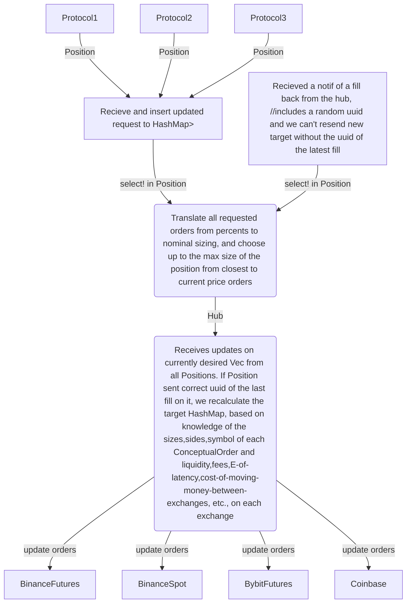

# Discretionary Engine


## Usage
Example query:
```sh
discretionary_engine new --size=-0.1 --symbol=ADAUSDT '-f=sar:t5m:s0.07:i0.02:m0.15' '-f=tpsl:t0.4884:s0.5190'
```
This would open a new position on ADA, where:
- Side: SELL, as the provided size is negative
- Size: 10% of the total balance
- rm_protocol_1: sar indicator, following the price action on 5m timeframe, with starting value 0.07, increase of 0.02, max 0.15
- rm_protocol_2: static tp and sl, which are set at 0.4884 and 0.5190, respectively

## Coverage
Currently only working with Binance.

## Configuration
Config is read from ${HOME}/.config/discretionary_engine.toml by default, but can also be specified via `--config` cli argument.

An example config can be found in ./examples/config.toml

## Current assumptions
- no two positions are opened on the same symbol

- no new positions on account are opened outside of the engine

- orders are placed immediately (not that far off, as most of the time we will spam the thing until it accepts, and only other action that will need to be taken is to prevent any increases in exposure while we have any mismatches).

# TODO for next version

- [x] is there a pattern to connect members of two enums?
    If yes, implement it, otherwise make them HashMap<str, String>

- [x] impl all `ProtocolCache` for Followups

- [ ] impl all `FollowupProtocol` for Followups

... To make price requests sync, and not have to deal with async traits, I'm making a compound orderbook implementation as a separate project now...


## State
Currently I am rewriting handling and initialization of exchange interactions in a separate crate.
Once I have a reasonable core here, it will be possible to either integrate it into here, or the other way around.
