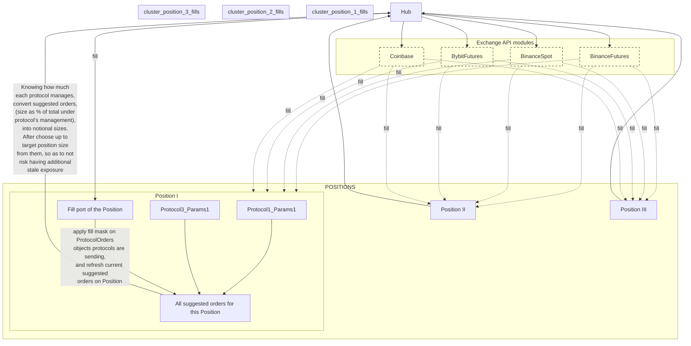

# Architecture

### `main.rs`
Cli entry

### `positions.rs`
Main acting element. Every exposed api function of the crate creates new position or edits an old one.

Position takes in _what it should be_, then figures out execution strategy for getting there. By default positions open the position being mindful of the market impact and best exchange from standpoint of latency and commissions, and that's it. For more control of execution details we expose [protocols](#protocols)) and split Position into `Acquisition` and `Followup` parts.

All Positions post updates of their desired outstanding orders to the [hub](#exchange-apis), when they decide on altering their executing strategy based on some new market data or information of fills on orders owned by them.

### `protocols/`
Way to control specifics of execution of the Position they are assigned to. Think of them as additional configuration settings for the Position. For more fine-grained control, protocols are split to `Acquisition` and `Followup`, specified for according stage of their Position's lifetime.

Protocols analyze any kind of market information relevant to the position they are attached to, and output their suggestion of their Position's behavior as they think is appropriate for the situation. Position then gives a predefined weight to the suggestions of each protocol, and joins them with those of others before deciding on which of the suggested orders it will be passing to Hub for execution.

All available protocols are predefined, and an api for manual on-demand creation of specific protocols from common market data is not currently planned.

### `exchange_apis/`
Interface through Hub, meant to synchronize information of all outstanding to allow for more efficient rerouting (considering e.g., current balances on exchanges). Hub keeps track of the _last_ sent Orders update from each Position, dynamically deciding how exactly and on which exchanges they should be executed, having ability to move them around.

Exchange interfaces themselves keep track only of the orders given to them by the Hub, and mostly deal with specifics of api of their respective exchange. No order changes transpire at this level, they are placed exactly as directed by the Hub.
